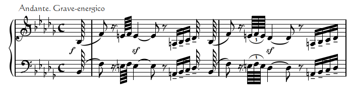
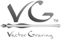

# VectorGraving

 

---

## SVG Music Notation

---

Scalable Vector Graphics (SVG) is an XML markup language, designed for
creating images for web browsers initially. By now, there are many other
programs that can read, manipulate and produce SVG files. If you are
unfamiliar with coding, don't be intimidated. Markup languages are among the
easiest to learn, and with the files I provide, the most difficult parts are
done for you.

For an introduction to SVG, try:

- [Tuts+](http://webdesign.tutsplus.com/articles/getting-started-with-scalable-vector-graphics-svg--webdesign-7515)
- [SVG-Whiz!](http://svg-whiz.com/)
- [SVGBasics](http://www.svgbasics.com/index.html)

---

Independent of my musical endeavors, I began learning SVG in 2004, fascinated 
by the ability to create images on a computer without any special program;
just a text file and Firefox. Being a guitarist, composer, transcriber, I tried
a number of music notation programs, and was always disappointed. It didn't take me long to start playing with the idea of using SVG. I had already created a bitmap library of music symbols, so off I went. One of the great things about
SVG is, there is no limitation on what symbols you have and what they look like, or how they are placed; a huge advantage over the programs I tried. SVG is mostly limited by your imagination and your knowledge of the language, and like most things, the more you use it, the easier it gets. I believe I've gotten to the point where I can turn out a piece of music faster than I could have using a
program, and nothing that I want in it is missing.

---

I've named the process VectorGraving.

&emsp;&emsp;&emsp;&emsp; 
